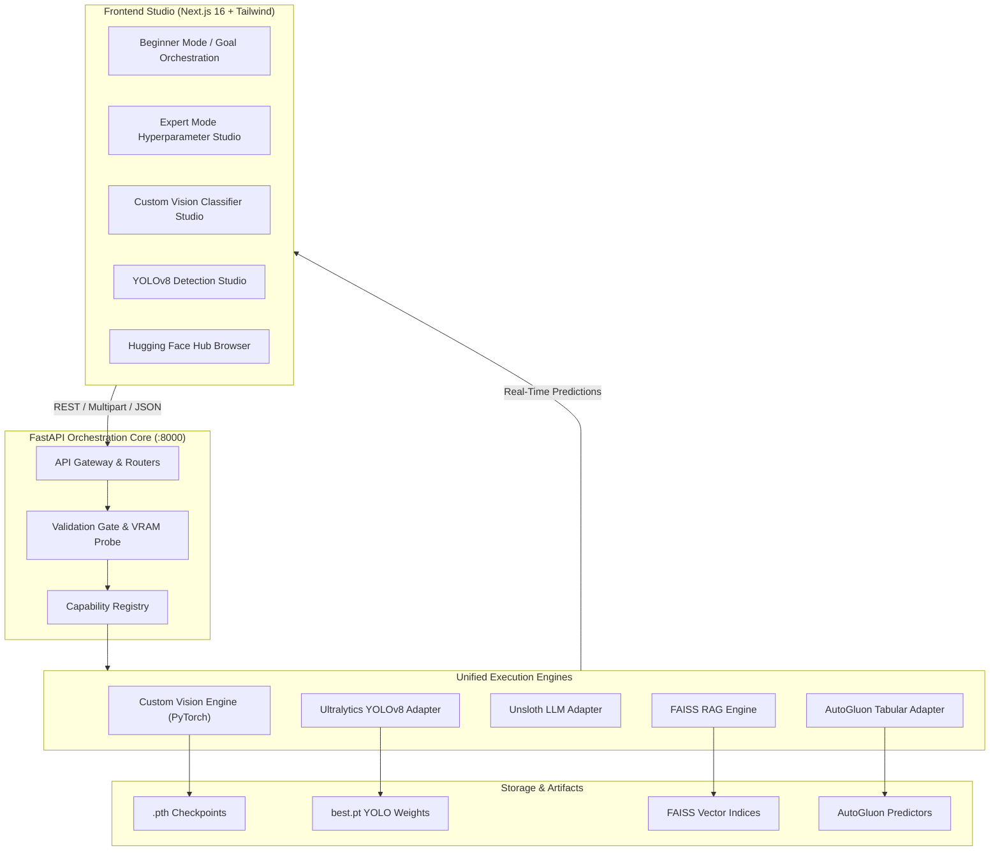

<div align="center">

# ⚡ Unified AI Platform

**An end-to-end, hardware-efficient AI workbench for fine-tuning LLMs, training computer vision classifiers, orchestrating RAG pipelines, and AutoML on tabular data.**

[](https://fastapi.tiangolo.com/)
[](https://nextjs.org/)
[](https://pytorch.org/)
[](https://pytorch.org/vision/)
[](https://ultralytics.com/)
[](https://github.com/unslothai/unsloth)
[](https://auto.gluon.ai/)

<br />

[Features](#-key-capabilities) • [Architecture](#-platform-architecture) • [Quick Start](#-quick-start) • [Vision Classifier](#-in-house-custom-vision-classifier) • [API Reference](#-api-endpoints)

</div>

---

## 📖 Overview

The **Unified AI Platform** democratizes machine learning by providing a unified web studio and automated backend for every major AI discipline. Whether you are training an interactive vision classifier from your webcam in 1 second, running tabular AutoML, indexing enterprise PDFs for RAG, or fine-tuning 3B parameter LLMs within a strict 6GB VRAM budget, the platform handles data preparation, hardware validation, training, and real-time deployment automatically.

---

## 🌟 Key Capabilities

| Capability | Engine / Backbone | Description | Hardware |
|---|---|---|---|
| **Custom Vision Classifier** | PyTorch + MobileNetV3 / ResNet18 | Interactive transfer-learning studio with webcam burst recording, sub-second training, and live <10ms streaming inference. | CUDA / CPU |
| **Object Detection Studio** | Ultralytics YOLOv8 | End-to-end YOLOv8 pipeline with dataset splitting, training, mAP metrics, and interactive bounding box visualization. | CUDA / CPU |
| **LLM Fine-Tuning** | Unsloth (4-bit QLoRA) | Fine-tune LLaMA-3.2 (1B/3B) and Qwen-2.5 (3B) with strict VRAM safeguards fitting on 4GB–6GB consumer GPUs. | NVIDIA CUDA |
| **Tabular AutoML** | AutoGluon | Automated feature engineering, model selection, and ensembling (XGBoost, LightGBM, Random Forest). | CPU |
| **Knowledge RAG** | FAISS + Sentence Transformers | Ingestion, chunking, vector indexing, and grounded query generation. | CPU |
| **Hugging Face Hub** | `huggingface_hub` API | In-app live search by modality/task, metadata inspection, and 1-click dynamic model registry import. | Any |

---

## 🏗️ Platform Architecture



---

## 📸 In-House Custom Vision Classifier

Train custom image classifiers directly in your browser with zero cloud dependencies:

```
+-----------------------------------------------------------------------------------+
|  CUSTOM VISION CLASSIFIER STUDIO                          Classes: 2  Samples: 240|
+-------------------------------------------------+---------------------------------+
|  [ #1 Hand (196) * ]  [ #2 Background (44) * ]  |  TRAIN MODEL                    |
|  +-------------------------------------------+  |  [ MobileNetV3 ]  [ ResNet18 ]  |
|  |  [ CAMERA FEED: Hand ]                    |  |  Epochs: 10   Batch: 8          |
|  |                                           |  |  +---------------------------+  |
|  |  [ HOLD TO RECORD SAMPLES ]  [ 1 SHOT ]   |  |  | TRAIN CUSTOM CLASSIFIER   |  |
|  +-------------------------------------------+  |  +---------------------------+  |
|  Filmstrip: [img][img][img][img][img]        |  |  * READY (98% Acc)   [.pth]    |
|                                                 +---------------------------------+
|                                                 |  LIVE TESTING (11ms latency)    |
|                                                 |  +---------------------------+  |
|                                                 |  | LIVE WEBCAM PREVIEW       |  |
|                                                 |  | * Hand (98%)              |  |
|                                                 |  +---------------------------+  |
|                                                 |  Hand        [==========] 98%   |
|                                                 |  Background  [=         ] 2%    |
+-------------------------------------------------+---------------------------------+
```

### How it works:
1. **Define Classes:** Click between class tabs (`Hand`, `Background`, etc.).
2. **Collect Data:** Open the camera and hold **"HOLD TO RECORD SAMPLES"** to capture frames at 10 FPS, or upload photos.
3. **Train in < 1 Second:** Click **"TRAIN CUSTOM CLASSIFIER"**. The PyTorch transfer learning engine freezes the backbone and trains the classification head with AdamW.
4. **Live Inference:** Instant continuous ~10 FPS camera prediction with probability bars and downloadable `.pth` PyTorch model checkpoints.

---

## 🚀 Quick Start

### Prerequisites
- **Python:** 3.10, 3.11, or 3.12
- **Node.js:** v18+ & npm
- **GPU:** NVIDIA GPU with CUDA 11.8+ or 12.x *(Optional: CPU fallback supported for vision classifier, AutoGluon, and RAG)*

---

### 1. Clone the Repository
```bash
git clone https://github.com/Aadrit555/Backend.git
cd Backend
```

---

### 2. Backend Setup

#### Create & Activate Virtual Environment
**Windows (PowerShell):**
```powershell
python -m venv .venv
.venv\Scripts\Activate.ps1
```

**Linux / macOS:**
```bash
python3 -m venv .venv
source .venv/bin/activate
```

#### Install Dependencies
```bash
pip install -r requirements.txt
```

#### Configure Environment Variables
Copy the example environment file:
```bash
cp backend/.env.example backend/.env
```

Edit `backend/.env` to configure your API keys:
```env
# Groq API Keys for Orchestration Planning (Primary + optional failovers)
GROQ_API_KEY_1=your_groq_api_key_here
GROQ_MODEL=openai/gpt-oss-120b

# Optional: OpenRouter for external fallback
OPENROUTER_API_KEY=
```

#### Start the FastAPI Server
```bash
python -m uvicorn backend.main:app --host 0.0.0.0 --port 8000 --reload
```
> 📍 Backend is live at **`http://localhost:8000`**  
> 📑 Swagger API Docs at **`http://localhost:8000/docs`**

---

### 3. Frontend Setup

In a new terminal window:
```bash
cd frontend
npm install
npm run dev
```
> 🌐 Web Studio is live at **`http://localhost:3000`**

---

## 📡 API Endpoints

### Custom Vision Classifier
| Method | Route | Description |
|---|---|---|
| `POST` | `/api/classifier/train` | Train a transfer model from base64 class images (`mobilenet_v3_small` / `resnet18`). |
| `POST` | `/api/classifier/predict` | Predict class confidences from webcam frame or image file. |
| `GET` | `/api/classifier/models` | List all trained custom vision models with metadata. |
| `GET` | `/api/classifier/{model_id}/download` | Download `.pth` PyTorch model checkpoint. |

### Computer Vision (YOLOv8)
| Method | Route | Description |
|---|---|---|
| `POST` | `/api/vision/predict` | Run object detection inference on an image with bounding box annotations. |
| `POST` | `/api/vision/sample` | Run sample object detection for quick visual testing. |

### Hugging Face Hub Integration
| Method | Route | Description |
|---|---|---|
| `GET` | `/api/hf/search` | Search models across Hugging Face Hub by task, modality, or keyword. |
| `POST` | `/api/hf/import` | Register a model repository from Hugging Face into the platform registry. |

### System & Orchestrator
| Method | Route | Description |
|---|---|---|
| `GET` | `/api/system/status` | Real-time GPU VRAM stats, active tasks, and environment health. |
| `POST` | `/api/orchestrator/run` | Autonomous natural language pipeline execution. |

---

## 📂 Project Structure

```
├── backend/
│   ├── adapters/            # Modular ML adapters (Unsloth, YOLOv8, AutoGluon, RAG)
│   ├── custom_vision_engine.py # Native PyTorch transfer learning engine
│   ├── api.py               # REST API routers & request validation
│   ├── main.py              # FastAPI server entry point & lifespan
│   ├── hf_hub.py            # Hugging Face Hub search & import client
│   ├── gpu_probe.py         # Hardware probing (nvidia-smi VRAM checks)
│   ├── registry/            # Capabilities registry (capabilities.yaml)
│   └── tests/               # PyTorch engine and endpoint integration test suites
│
├── frontend/
│   ├── src/app/             # Next.js App Router (Studio pages & tabs)
│   └── src/components/      # CustomVisionStudio, YOLOv8 Studio, HF Browser
│
├── PROJECT_STATUS.md        # Detailed engineering status & milestones
└── requirements.txt         # Python dependencies
```

---

## 🧪 Testing

Run backend test suites:
```bash
python -m pytest backend/tests/test_custom_vision_engine.py backend/tests/test_custom_vision_api.py -v
```

Verify frontend build:
```bash
cd frontend
npm run build
```

---

## 📜 License

This project is licensed under the Apache 2.0 License.
