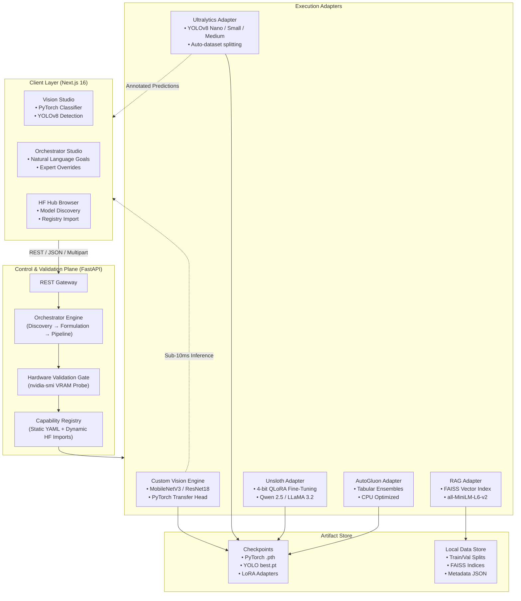

# Unified AI Platform

A modular, hardware-conscious machine learning workbench for fine-tuning large language models under strict consumer VRAM constraints, training interactive vision classifiers with PyTorch, running object detection pipelines, and automating tabular model selection.

---

## Architecture

The platform separates user interaction, pipeline orchestration, hardware safety validation, and isolated execution backends:



---

## Core Systems

### 1. In-House Custom Vision Classifier
- **Backbones:** Pretrained MobileNetV3-Small (default, 9MB footprint) and ResNet18 (45MB).
- **Transfer Head:** Frozen convolutional feature extractor with a trainable linear projection layer optimized via AdamW and Cross-Entropy Loss.
- **Workflow:** Capture webcam snapshots via burst mode (10 FPS) across class tabs, train in under 1 second on CUDA, and stream live predictions with latency under 10ms.
- **Persistence:** Exports standalone PyTorch `.pth` state dictionaries containing class mappings, model weights, and normalization metadata.

### 2. Computer Vision Studio (YOLOv8)
- **Engine:** Ultralytics YOLOv8 (nano, small, medium).
- **Pipeline:** Automated dataset structuring from archives or raw image directories, train/validation split management, and mAP evaluation.
- **Testing Interface:** Live image testing with dynamic confidence threshold controls and annotated bounding box rendering.

### 3. LLM Fine-Tuning (Unsloth)
- **Target Hardware:** Tested against a 5.66GB usable VRAM constraint (RTX 3050 Laptop GPU).
- **Methods:** 4-bit QLoRA instruction tuning with gradient checkpointing and memory tracking (`torch.cuda.max_memory_reserved`).
- **Supported Models:** LLaMA-3.2 (1B, 3B) and Qwen-2.5 (3B).

### 4. Tabular AutoML (AutoGluon)
- **Engine:** AutoGluon TabularPredictor on CPU.
- **Models:** Stacks and ensembles XGBoost, LightGBM, CatBoost, and Random Forest.
- **Output:** Leaderboard evaluation and automated inference API deployment.

### 5. Grounded RAG
- **Index:** FAISS vector index with `sentence-transformers/all-MiniLM-L6-v2` embeddings.
- **Generation:** Context retrieval combined with structured LLM response generation.

### 6. Hugging Face Hub Integration
- In-studio search across Hugging Face Hub filtered by modality, task, and download counts.
- Dynamic registration of repository IDs directly into the local `capabilities.yaml` registry.

---

## Quick Start

### Requirements
- **Python:** 3.10 to 3.12
- **Node.js:** v18 or newer
- **CUDA:** 11.8 or 12.x recommended for GPU acceleration (CPU fallback available for vision classification, AutoGluon, and RAG)

---

### Installation

1. **Clone repository:**
   ```bash
   git clone https://github.com/Aadrit555/Backend.git
   cd Backend
   ```

2. **Backend environment:**
   ```bash
   # Windows (PowerShell)
   python -m venv .venv
   .venv\Scripts\Activate.ps1

   # Linux / macOS
   python3 -m venv .venv
   source .venv/bin/activate

   pip install -r requirements.txt
   ```

3. **Environment configuration:**
   ```bash
   cp backend/.env.example backend/.env
   ```
   Provide your Groq API key in `backend/.env` for pipeline planning:
   ```env
   GROQ_API_KEY_1=gsk_your_key_here
   GROQ_MODEL=openai/gpt-oss-120b
   ```

4. **Frontend setup:**
   ```bash
   cd frontend
   npm install
   ```

---

### Running the Services

Start the backend service:
```bash
python -m uvicorn backend.main:app --host 0.0.0.0 --port 8000 --reload
```

In a separate terminal, start the frontend interface:
```bash
cd frontend
npm run dev
```

| Service | Address | Purpose |
|---|---|---|
| Frontend Web Studio | `http://localhost:3000` | Interactive workbench and testing studio |
| Backend API | `http://localhost:8000` | REST API service |
| OpenAPI Specification | `http://localhost:8000/docs` | Interactive Swagger endpoint documentation |

---

## API Reference

### Custom Vision Classifier

| Endpoint | Method | Input | Output |
|---|---|---|---|
| `/api/classifier/train` | `POST` | `classes: dict[str, list[str]]`, `backbone: str`, `epochs: int`, `lr: float`, `batch_size: int` | Model metadata, fit time, accuracy |
| `/api/classifier/predict` | `POST` | JSON `{ image, model_id }` or multipart form | Top class, probability distribution, latency (ms) |
| `/api/classifier/models` | `GET` | None | List of stored models and metadata |
| `/api/classifier/{id}/download` | `GET` | `id: str` | Binary `.pth` PyTorch model file |

### Computer Vision (YOLOv8)

| Endpoint | Method | Input | Output |
|---|---|---|---|
| `/api/vision/predict` | `POST` | Multipart image file, `model_id: str`, `conf_threshold: float` | Bounding boxes, class names, annotated base64 image |
| `/api/vision/sample` | `POST` | None | Sample detection output |

### Hugging Face Hub

| Endpoint | Method | Input | Output |
|---|---|---|---|
| `/api/hf/search` | `GET` | `query: str`, `task: str`, `modality: str` | Matched repository list with metrics |
| `/api/hf/import` | `POST` | `repo_id: str`, `task: str`, `modality: str` | Registration status in capability registry |

### System Status

| Endpoint | Method | Input | Output |
|---|---|---|---|
| `/api/system/status` | `GET` | None | GPU VRAM utilization, active tasks, memory state |

---

## Repository Structure

```
├── backend/
│   ├── adapters/                # Model execution adapters (Unsloth, YOLOv8, AutoGluon, RAG)
│   ├── custom_vision_engine.py  # Native PyTorch transfer learning engine
│   ├── api.py                   # FastAPI route definitions
│   ├── config.py                # Environment configuration
│   ├── gpu_probe.py             # nvidia-smi VRAM monitoring
│   ├── hf_hub.py                # Hugging Face API client
│   ├── main.py                  # Server entry point and lifecycle hooks
│   ├── registry/                # Capability registry definitions (capabilities.yaml)
│   └── tests/                   # Automated pytest suites
│
├── frontend/
│   ├── src/app/                 # Next.js App Router (pages and layouts)
│   └── src/components/          # CustomVisionStudio, YOLO Studio, Hub Browser
│
├── requirements.txt             # Backend dependencies
└── PROJECT_STATUS.md            # Hardware diagnostics and milestone log
```

---

## Verification & Testing

Execute backend test suites:
```bash
python -m pytest backend/tests/test_custom_vision_engine.py backend/tests/test_custom_vision_api.py -v
```

Verify frontend build:
```bash
cd frontend
npm run build
```

---

## License

Apache License 2.0. See `LICENSE` for details.
