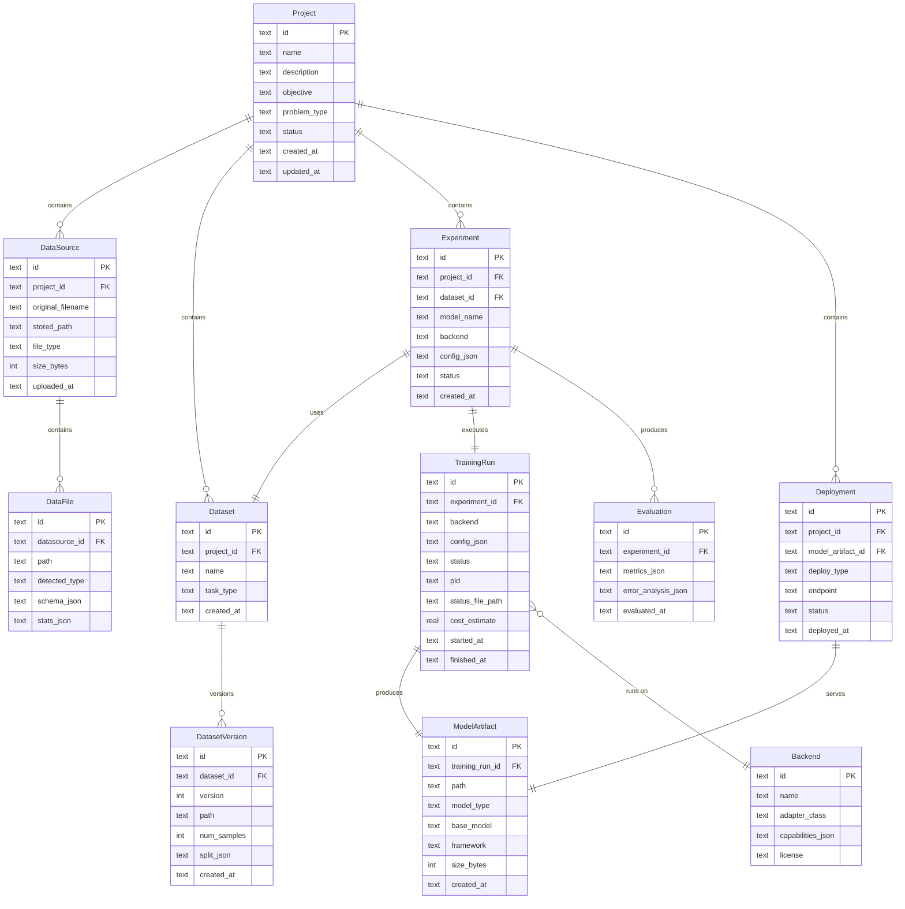

# ARCHITECTURE.md — Unified AI/ML Model Builder

> **This is the implementation contract.** Every interface, schema, and
> decision here is derived from [THE_bible.MD](./THE_bible.MD) plus the
> locked decisions below. Code that contradicts this file is wrong.

---

## Locked Decisions

| Decision | Value |
|---|---|
| Orchestrator LLM | GPT OSS 120B via **Groq API** (tool-calling) (Note: Llama 3.3 70B was deprecated June 17, 2026) |
| Deployment model | Local-first, single machine, single user |
| Auth / multi-tenancy | None in MVP |
| GPU | User's own local GPU; `estimate_vram()` gates every proposal |
| Task queue | None — training runs as a local background subprocess |
| Training status | Status file + WebSocket the frontend polls |
| Database | SQLite (swap to Postgres if we ever go multi-user) |
| Frontend | Next.js |
| Backend | FastAPI (Python) |

---

## 1. System Diagram

*(BIBLE §39, adapted for local-first single-user)*

```text
                         FRONTEND
                        (Next.js)
                            │
                        WebSocket + REST
                            │
                            ▼
                      ┌───────────┐
                      │  FastAPI   │
                      └─────┬─────┘
                            │
             ┌──────────────┼──────────────┐
             │              │              │
             ▼              ▼              ▼
          Projects        Data          Models
             │              │              │
             └──────────────┼──────────────┘
                            │
                            ▼
                    ┌───────────────┐
                    │  ORCHESTRATOR │
                    │ (GPT OSS     │
                    │ 120B / Groq) │
                    └───────┬──────┘
                            │
              ┌─────────────┼─────────────┐
              ▼             ▼             ▼
         Data Agent      Planner      Evaluator
              │             │             │
              └─────────────┼─────────────┘
                            │
                   VALIDATION GATE
                   (schema + capability check)
                            │
                       ADAPTER LAYER
                            │
          ┌─────────────────┼──────────────────┐
          ▼                 ▼                   ▼
     LLaMA-Factory      Unsloth            AutoGluon
          │                 │                   │
          ▼                 ▼                   ▼
       Qwen/Llama       LLM training        ML models

                            │
                            ▼

                     LOCAL DEPLOYMENT
                            │
                   ┌────────┼────────┐
                   ▼        ▼        ▼
                 Chat    REST API   Export
               (gradio)  (FastAPI)  (file)
```

**Key differences from BIBLE §39:**
- No Vertex AI / SageMaker / Docker cloud layer
- No Redis/worker queue — subprocess + status file
- No multi-tenant DB — single SQLite file
- Validation gate inserted between orchestrator and adapter layer

---

## 2. Entity / DB Schema

*(BIBLE §44, simplified for single-user — no User/tenant entities)*



---

## 3. BackendAdapter Abstract Interface

*(BIBLE §18)*

```python
"""backend/adapters/base.py — BIBLE §17-18

Every training backend (LLaMA-Factory, Unsloth, AutoGluon, Ultralytics, …)
is accessed exclusively through a subclass of BackendAdapter.
The rest of the platform never imports a framework directly.
"""

from __future__ import annotations
from abc import ABC, abstractmethod
from dataclasses import dataclass
from pathlib import Path
from typing import Any


@dataclass
class ResourceEstimate:
    """Returned by estimate_resources(). All fields are best-effort."""
    vram_required_mb: int
    ram_required_mb: int
    disk_required_mb: int
    estimated_training_seconds: int | None = None
    estimated_cost_usd: float | None = None


@dataclass
class TrainingResult:
    """Returned by train()."""
    artifact_path: Path
    metrics: dict[str, Any]
    logs_path: Path | None = None


@dataclass
class EvaluationResult:
    """Returned by evaluate()."""
    metrics: dict[str, Any]
    error_analysis: dict[str, Any] | None = None


class BackendAdapter(ABC):
    """Abstract interface that every training backend must implement."""

    @abstractmethod
    def capabilities(self) -> dict[str, Any]:
        """Return a structured description of what this backend supports.

        Must include at minimum:
          - supported_tasks: list[str]
          - supported_models: list[str]
          - supported_training_methods: list[str]
          - supported_export_formats: list[str]
        """
        ...

    @abstractmethod
    def prepare(
        self,
        dataset_path: Path,
        config: dict[str, Any],
    ) -> Path:
        """Convert/validate the dataset into the format this backend expects.

        Returns the path to the prepared dataset directory.
        """
        ...

    @abstractmethod
    def train(
        self,
        dataset_path: Path,
        config: dict[str, Any],
    ) -> TrainingResult:
        """Launch training synchronously (called inside the background subprocess).

        Returns a TrainingResult with the artifact path and metrics.
        """
        ...

    @abstractmethod
    def evaluate(
        self,
        model_path: Path,
        dataset_path: Path,
        config: dict[str, Any],
    ) -> EvaluationResult:
        """Run evaluation on a trained model."""
        ...

    @abstractmethod
    def export(
        self,
        model_path: Path,
        export_format: str,
        output_path: Path,
    ) -> Path:
        """Export/convert a trained model to the requested format."""
        ...

    @abstractmethod
    def estimate_resources(
        self,
        model_name: str,
        dataset_size: int,
        config: dict[str, Any],
    ) -> ResourceEstimate:
        """Estimate VRAM, RAM, disk, time, and cost BEFORE training starts.

        This is called by the validation gate to check feasibility
        against the user's local GPU before the orchestrator's proposal
        is accepted.
        """
        ...

    @abstractmethod
    def deploy(
        self,
        model_path: Path,
        deploy_config: dict[str, Any],
    ) -> dict[str, Any]:
        """Deploy a trained model locally. Returns connection info (endpoint, etc.)."""
        ...
```

---

## 4. Orchestrator Tool Schemas (Groq tool-calling)

*(BIBLE §41. Flat parameters, no deep nesting — Groq-safe.)*

Each tool is registered with Groq's `tools` parameter as a function with
a JSON Schema. Below are the canonical definitions. The orchestrator
(`groq_client.py`) sends these verbatim.

```json
[
  {
    "type": "function",
    "function": {
      "name": "inspect_files",
      "description": "List and identify the types of all files in a data source.",
      "parameters": {
        "type": "object",
        "properties": {
          "datasource_id": { "type": "string", "description": "ID of the uploaded data source." }
        },
        "required": ["datasource_id"]
      }
    }
  },
  {
    "type": "function",
    "function": {
      "name": "inspect_dataset",
      "description": "Return schema, stats, and sample rows for a dataset version.",
      "parameters": {
        "type": "object",
        "properties": {
          "dataset_version_id": { "type": "string", "description": "ID of the dataset version." }
        },
        "required": ["dataset_version_id"]
      }
    }
  },
  {
    "type": "function",
    "function": {
      "name": "analyze_schema",
      "description": "Detect column types, missing values, cardinality, and potential target columns in a CSV/tabular source.",
      "parameters": {
        "type": "object",
        "properties": {
          "datasource_id": { "type": "string", "description": "ID of the data source." }
        },
        "required": ["datasource_id"]
      }
    }
  },
  {
    "type": "function",
    "function": {
      "name": "find_relationships",
      "description": "Discover join keys or semantic relationships across multiple data sources in a project.",
      "parameters": {
        "type": "object",
        "properties": {
          "project_id": { "type": "string", "description": "Project ID." }
        },
        "required": ["project_id"]
      }
    }
  },
  {
    "type": "function",
    "function": {
      "name": "create_dataset",
      "description": "Construct a training dataset from one or more data sources, applying transformations.",
      "parameters": {
        "type": "object",
        "properties": {
          "project_id":    { "type": "string", "description": "Project ID." },
          "datasource_ids": { "type": "string", "description": "Comma-separated data source IDs." },
          "task_type":     { "type": "string", "description": "ML task type: classification, regression, fine_tuning, object_detection, etc." },
          "target_column": { "type": "string", "description": "Target/label column name (if applicable)." },
          "instructions":  { "type": "string", "description": "Free-text instructions for dataset construction." }
        },
        "required": ["project_id", "datasource_ids", "task_type"]
      }
    }
  },
  {
    "type": "function",
    "function": {
      "name": "clean_dataset",
      "description": "Run automated cleaning on a dataset version: dedup, handle missing values, fix encodings, detect outliers.",
      "parameters": {
        "type": "object",
        "properties": {
          "dataset_version_id": { "type": "string", "description": "ID of the dataset version to clean." },
          "operations":         { "type": "string", "description": "Comma-separated cleaning ops: dedup, drop_missing, fix_encoding, remove_outliers, rebalance." }
        },
        "required": ["dataset_version_id"]
      }
    }
  },
  {
    "type": "function",
    "function": {
      "name": "list_models",
      "description": "List available base models, optionally filtered by task type or modality.",
      "parameters": {
        "type": "object",
        "properties": {
          "task_type": { "type": "string", "description": "Filter: classification, regression, fine_tuning, object_detection, etc." },
          "modality":  { "type": "string", "description": "Filter: text, image, tabular, audio." }
        },
        "required": []
      }
    }
  },
  {
    "type": "function",
    "function": {
      "name": "get_model_capabilities",
      "description": "Return detailed capability info for a specific model: supported tasks, training methods, VRAM needs, backends.",
      "parameters": {
        "type": "object",
        "properties": {
          "model_name": { "type": "string", "description": "Model identifier, e.g. 'qwen2.5-7b', 'yolov8n'." }
        },
        "required": ["model_name"]
      }
    }
  },
  {
    "type": "function",
    "function": {
      "name": "estimate_vram",
      "description": "Check whether a proposed model + training config fits in the user's local GPU. Returns fit/no-fit and required vs available VRAM.",
      "parameters": {
        "type": "object",
        "properties": {
          "model_name":      { "type": "string", "description": "Model identifier." },
          "training_method": { "type": "string", "description": "sft, lora, qlora, full, autogluon, etc." },
          "dataset_size":    { "type": "integer", "description": "Number of samples in the dataset." },
          "batch_size":      { "type": "integer", "description": "Proposed batch size." }
        },
        "required": ["model_name", "training_method"]
      }
    }
  },
  {
    "type": "function",
    "function": {
      "name": "estimate_cost",
      "description": "Estimate wall-clock time and electricity cost for a training run. Local-only in MVP.",
      "parameters": {
        "type": "object",
        "properties": {
          "model_name":      { "type": "string", "description": "Model identifier." },
          "training_method": { "type": "string", "description": "Training method." },
          "dataset_size":    { "type": "integer", "description": "Number of samples." },
          "epochs":          { "type": "integer", "description": "Number of epochs." }
        },
        "required": ["model_name", "training_method", "dataset_size"]
      }
    }
  },
  {
    "type": "function",
    "function": {
      "name": "create_experiment",
      "description": "Register a new experiment: a specific (model, dataset_version, config, backend) combination.",
      "parameters": {
        "type": "object",
        "properties": {
          "project_id":          { "type": "string",  "description": "Project ID." },
          "dataset_version_id":  { "type": "string",  "description": "Dataset version ID." },
          "model_name":          { "type": "string",  "description": "Base model identifier." },
          "backend":             { "type": "string",  "description": "Backend adapter: llama_factory, unsloth, autogluon, ultralytics." },
          "training_method":     { "type": "string",  "description": "sft, lora, qlora, full, autogluon, etc." },
          "config_json":         { "type": "string",  "description": "JSON string of additional hyperparameters (flat key-value)." }
        },
        "required": ["project_id", "dataset_version_id", "model_name", "backend", "training_method"]
      }
    }
  },
  {
    "type": "function",
    "function": {
      "name": "start_training",
      "description": "Launch a training run for an experiment as a local background subprocess.",
      "parameters": {
        "type": "object",
        "properties": {
          "experiment_id": { "type": "string", "description": "Experiment ID." }
        },
        "required": ["experiment_id"]
      }
    }
  },
  {
    "type": "function",
    "function": {
      "name": "get_training_status",
      "description": "Poll the status of a running or completed training run.",
      "parameters": {
        "type": "object",
        "properties": {
          "experiment_id": { "type": "string", "description": "Experiment ID." }
        },
        "required": ["experiment_id"]
      }
    }
  },
  {
    "type": "function",
    "function": {
      "name": "evaluate_model",
      "description": "Run the evaluation suite on a trained model against a dataset version.",
      "parameters": {
        "type": "object",
        "properties": {
          "experiment_id":       { "type": "string", "description": "Experiment ID (resolves to the trained artifact)." },
          "dataset_version_id":  { "type": "string", "description": "Dataset version to evaluate against (defaults to test split)." }
        },
        "required": ["experiment_id"]
      }
    }
  },
  {
    "type": "function",
    "function": {
      "name": "analyze_errors",
      "description": "Break down model failures by class, category, or data segment to find dominant error sources.",
      "parameters": {
        "type": "object",
        "properties": {
          "evaluation_id": { "type": "string", "description": "Evaluation ID." }
        },
        "required": ["evaluation_id"]
      }
    }
  },
  {
    "type": "function",
    "function": {
      "name": "compare_models",
      "description": "Compare metrics across multiple experiments in the same project.",
      "parameters": {
        "type": "object",
        "properties": {
          "experiment_ids": { "type": "string", "description": "Comma-separated experiment IDs to compare." }
        },
        "required": ["experiment_ids"]
      }
    }
  },
  {
    "type": "function",
    "function": {
      "name": "improve_dataset",
      "description": "Apply a targeted improvement to a dataset version: augment, rebalance, remove noisy samples, add synthetic data.",
      "parameters": {
        "type": "object",
        "properties": {
          "dataset_version_id": { "type": "string", "description": "Dataset version to improve." },
          "strategy":           { "type": "string", "description": "Improvement strategy: augment, rebalance, denoise, synthetic, relabel." },
          "instructions":       { "type": "string", "description": "Free-text guidance for the improvement." }
        },
        "required": ["dataset_version_id", "strategy"]
      }
    }
  },
  {
    "type": "function",
    "function": {
      "name": "deploy_model",
      "description": "Deploy a trained model locally for inference.",
      "parameters": {
        "type": "object",
        "properties": {
          "experiment_id": { "type": "string", "description": "Experiment whose trained artifact to deploy." },
          "deploy_type":   { "type": "string", "description": "Deployment type: chat, rest_api, export_file." }
        },
        "required": ["experiment_id", "deploy_type"]
      }
    }
  }
]
```

### Design notes for Groq compatibility

- All parameter types are `string` or `integer` — no nested objects, no
  arrays, no enums. Groq's Llama tool-calling is less forgiving than
  GPT-4 on complex schemas.
- Where we'd naturally want an array (e.g. `experiment_ids`), we use a
  comma-separated string and parse server-side.
- `config_json` is passed as a flat JSON *string*, parsed server-side.
  This keeps the schema depth at 1.

---

## 5. Validation Gate

*(BIBLE §40, §58)*

Every tool call from the GPT OSS 120B orchestrator passes through a
**validation gate** before any side-effect executes. The gate is
deterministic Python code — never an LLM.

### Gate pipeline

```text
Orchestrator (LLM)
       │
       │  tool_call JSON
       ▼
┌─────────────────────┐
│  1. SCHEMA VALIDATE  │  — Does the JSON match the tool's JSON Schema?
└──────────┬──────────┘
           │ fail → return schema error to LLM (retry)
           ▼
┌─────────────────────┐
│ 2. ENTITY RESOLVE   │  — Do referenced IDs (project, dataset, etc.) exist in SQLite?
└──────────┬──────────┘
           │ fail → return "entity not found" to LLM (retry)
           ▼
┌─────────────────────┐
│ 3. CAPABILITY CHECK  │  — Is the requested (model, backend, task) combination
│                      │    supported per the Capability Registry?
└──────────┬──────────┘
           │ fail → return capability mismatch to LLM (retry)
           ▼
┌─────────────────────┐
│ 4. VRAM GATE        │  — For training/deploy tools: does estimated VRAM
│                      │    fit detected local GPU?
└──────────┬──────────┘
           │ fail → return VRAM insufficient + available VRAM to LLM (retry)
           ▼
┌─────────────────────┐
│ 5. EXECUTE          │  — Deterministic code runs the tool.
└──────────┬──────────┘
           │
           ▼
     Return result to LLM
```

### Failure behaviour

| Failure stage | What happens |
|---|---|
| Schema validation | Reject. Return `{"error": "schema_error", "detail": "..."}` to LLM. LLM retries. |
| Entity not found | Reject. Return `{"error": "not_found", "detail": "..."}` to LLM. LLM retries. |
| Capability mismatch | Reject. Return `{"error": "capability_mismatch", "detail": "...", "supported_alternatives": [...]}` to LLM. LLM picks an alternative. |
| VRAM insufficient | Reject. Return `{"error": "vram_insufficient", "required_mb": N, "available_mb": M, "suggestions": [...]}` to LLM. LLM picks a smaller model/quantization. |
| Execution error | Return `{"error": "execution_error", "detail": "..."}` to LLM. LLM decides whether to retry or report to user. |

**Critical rule:** the gate never silently proceeds on failure. Every
rejection is surfaced to the LLM with enough context to self-correct.
Maximum retries per tool call: **3**, after which the orchestrator
reports the failure to the user.

### Capability Registry format

The registry is a static YAML file (`backend/registry/capabilities.yaml`)
loaded at startup. Schema:

```yaml
models:
  qwen2.5-7b:
    modalities: [text]
    tasks: [fine_tuning, text_generation]
    training_methods: [sft, lora, qlora]
    backends: [llama_factory, unsloth]
    vram_estimates:
      lora:  { min_mb: 8000,  recommended_mb: 16000 }
      qlora: { min_mb: 5000,  recommended_mb: 10000 }
      sft:   { min_mb: 28000, recommended_mb: 48000 }
    license: apache-2.0

  yolov8n:
    modalities: [image, video]
    tasks: [object_detection, classification]
    training_methods: [full]
    backends: [ultralytics]
    vram_estimates:
      full: { min_mb: 4000, recommended_mb: 8000 }
    license: agpl-3.0

backends:
  llama_factory:
    adapter_class: backend.adapters.llama_factory.LlamaFactoryAdapter
    license: apache-2.0
  autogluon:
    adapter_class: backend.adapters.autogluon.AutoGluonAdapter
    license: apache-2.0
```

---

## 6. Storage Layout (local filesystem)

```text
~/.unified/
├── db/
│   └── unified.sqlite3
├── projects/
│   └── {project_id}/
│       ├── raw/              # immutable uploaded files (BIBLE §43)
│       ├── datasets/
│       │   └── {dataset_id}/
│       │       └── v{N}/     # versioned processed datasets
│       ├── experiments/
│       │   └── {experiment_id}/
│       │       ├── config.json
│       │       ├── status.json   # polled by frontend
│       │       ├── logs/
│       │       └── artifacts/    # trained model files
│       └── deployments/
│           └── {deployment_id}/
└── registry/
    └── capabilities.yaml     # loaded at startup
```

---

## 7. Training Subprocess Protocol

*(No Redis/queue — BIBLE §42 adapted for local-first)*

```text
FastAPI endpoint: POST /api/training/start
       │
       ├─ Validation gate (§5 above)
       │
       ├─ Writes config to experiments/{id}/config.json
       │
       ├─ Spawns: subprocess.Popen(["python", "run_training.py", experiment_id])
       │
       └─ Returns 202 Accepted + experiment_id

Background subprocess (run_training.py):
       │
       ├─ Writes status.json: {"status": "preparing", "progress": 0}
       ├─ Calls adapter.prepare()
       ├─ Writes status.json: {"status": "training", "progress": 0, "epoch": 0}
       ├─ Calls adapter.train()  (updates status.json periodically)
       ├─ Writes status.json: {"status": "evaluating"}
       ├─ Calls adapter.evaluate()
       └─ Writes status.json: {"status": "completed", "metrics": {...}}
            or: {"status": "failed", "error": "..."}

Frontend polls: GET /api/training/{experiment_id}/status
       │
       └─ Reads and returns status.json contents

WebSocket (optional upgrade): ws://localhost:8000/ws/training/{experiment_id}
       │
       └─ Pushes status.json changes in real-time
```
